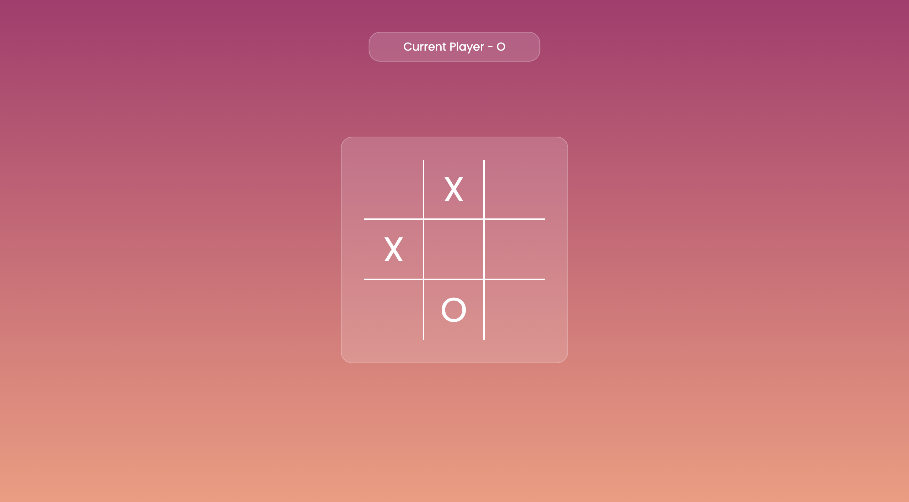
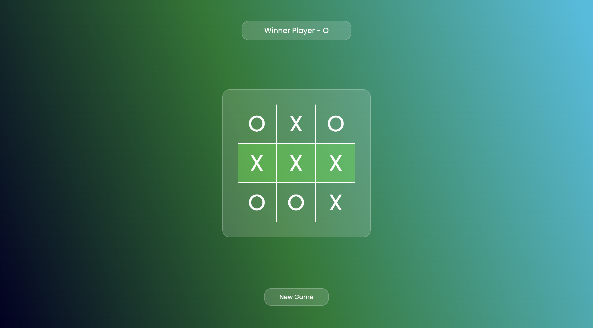

# 🎮 Tic Tac Toe Web Game

A classic **Tic Tac Toe** game built using **HTML, CSS, and JavaScript**. This project allows two players to play turn by turn, with interactive UI and win/draw detection logic. It's a fun way to practice DOM manipulation, styling, and JavaScript logic!

---

## 🚀 Features

- 🧑‍🤝‍🧑 Two-player gameplay
- 🧠 Real-time win/draw detection
- 🔄 Reset game functionality
- 🎨 Responsive and clean UI using CSS

---

## 🛠 Technologies Used

- **HTML** – Markup structure
- **CSS** – Styling and layout
- **JavaScript** – Game logic and interactivity

---

## 🎯 How to Play

1. Players take turns to place their mark (❌ or ⭕) on the grid.
2. First player to align 3 marks in a row (horizontally, vertically, or diagonally) wins.
3. If all boxes are filled without a winner, it’s a draw.

---

## 🌟 Screenshots

> 
> 

---

## 📁 Project Setup

No installation needed. Simply clone or download the repo and open the `index.html` file in your browser or Go Live from VS Code.

```bash
git clone https://github.com/paveshkanungo/Tic-Tac-Toe-Project.git
cd Tic-Tac-Toe-Project
```